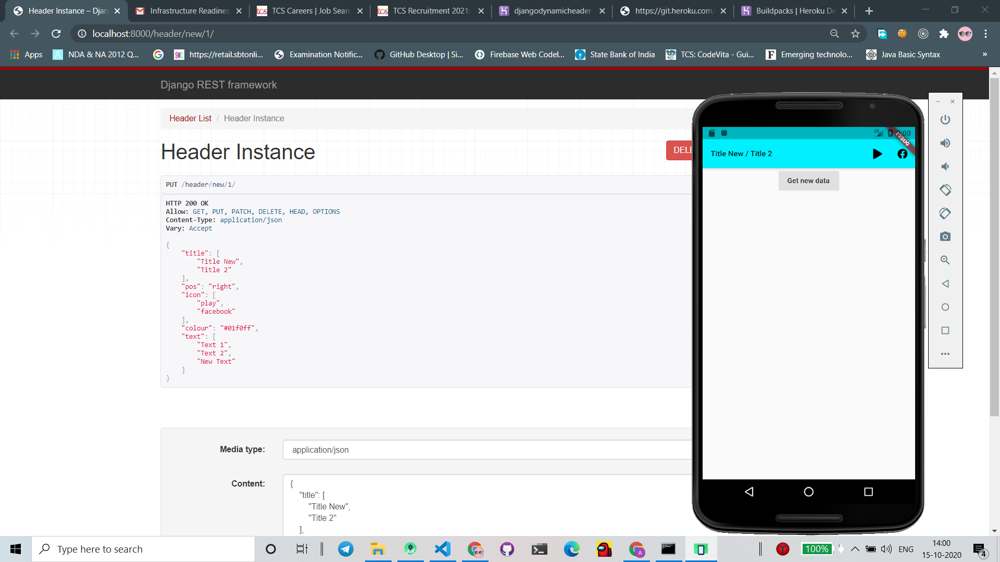
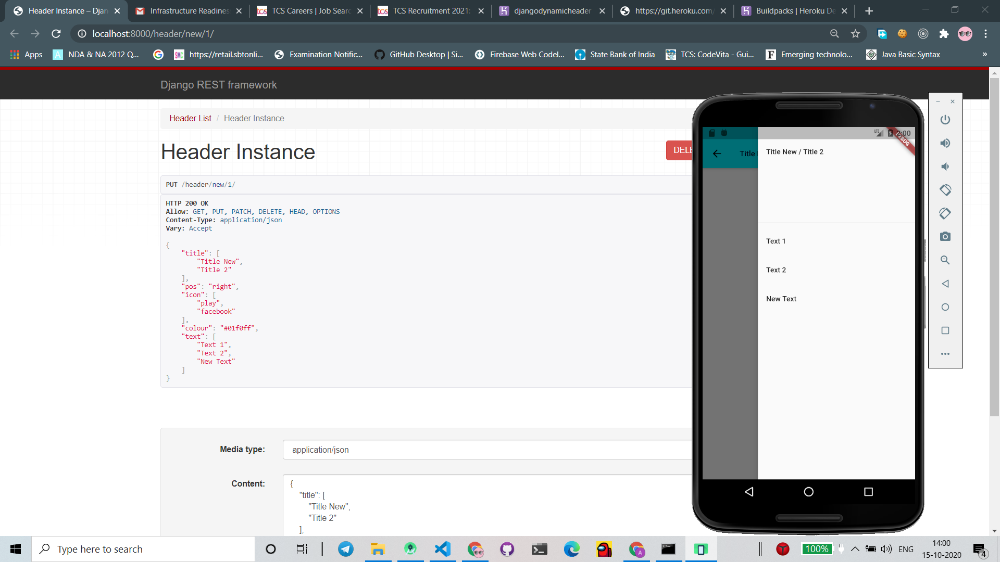

# Dynamic Header Module 

## Django-React-Postgresql

Run following codes after getting into directory

### For running virtualenv
```
cd var/project/projectenv
Scripts\activate  
```
### Run the server - development( while connecting flutter)
```
cd ./Proj 
python manage.py runserver 0.0.0.0:8000
```
### If updating js files and checking changes in server simultaneously
```
cd var/project/projectenv/frontend
npm run watch
```
### Sample Outputs





